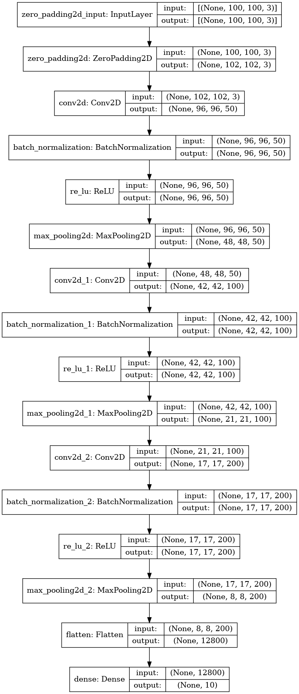
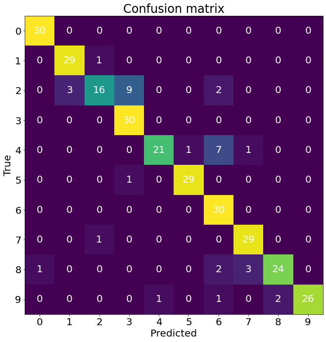

# Computer Vision: Sign Language Digits Recognition

The kaggle task: https://www.kaggle.com/javaidahmadwani/sign-language-digits-dataset

## Dataset

This data set contains images of sign language digits. There are ten classes, labeled as 0 through 9, and each class is made up of images of hands showing the sign for that particular digit.

Each class has between 204 and 208 samples. The total data set contains 2062 samples.

- Image size: 100 x 100 pixels
- Color space: RGB
- Number of classes: 10 (Digits: 0-9)

## Libraries

`pip install -r requirements.txt`

- numPy
- tensorFlow
- pickle
- PIL
- glob

## How to run?

To test the model on your own photo you just have to run the `main.py` file. You'll be able to upload your photo(doesn't handle `.heic` ext).

## Neural Network Models
Current best accuracy on the cross-validation set: `95.7%`

| Model           | Train Set Accuracy    | CV Set Accuracy       |
|-----------------|:---------------------:|:---------------------:|
| Custom convNet  | *99.8%*               | **95.7%**             |
| Resnet          | *97.4%*               | *89.3%*               |

### Custom ConvNet Structure

  

## Confusion Matrix (Custom convNet)

  

